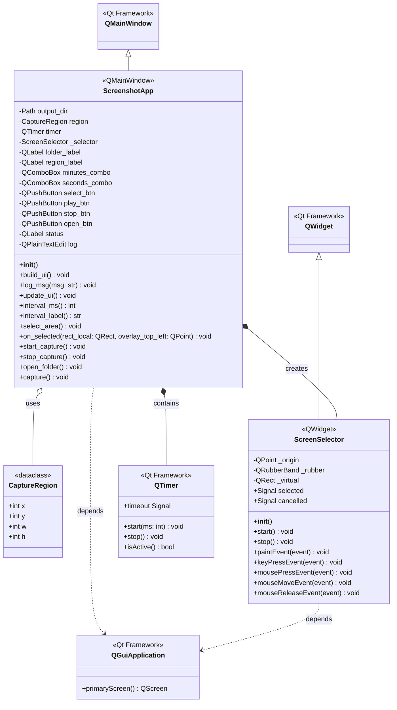
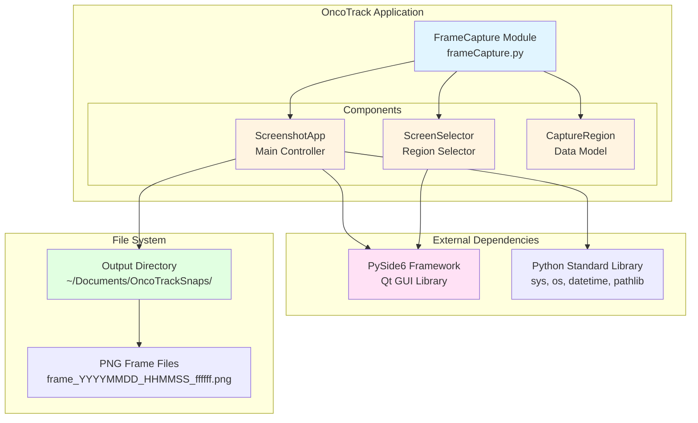
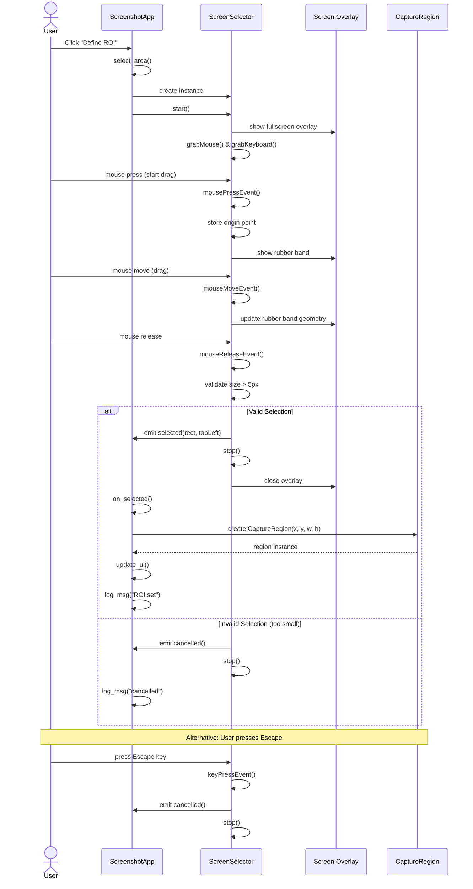
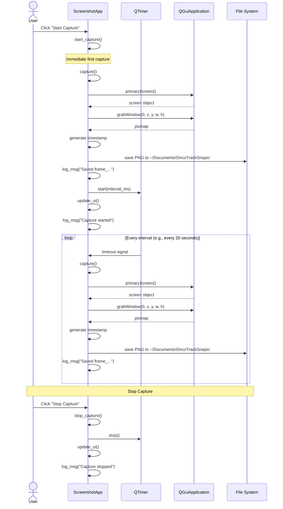
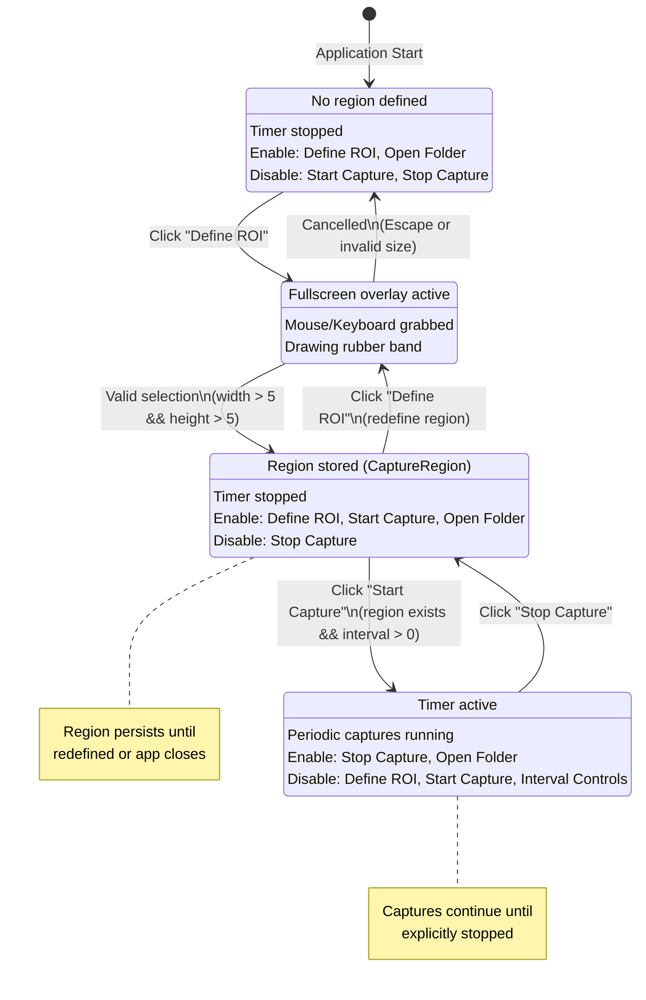
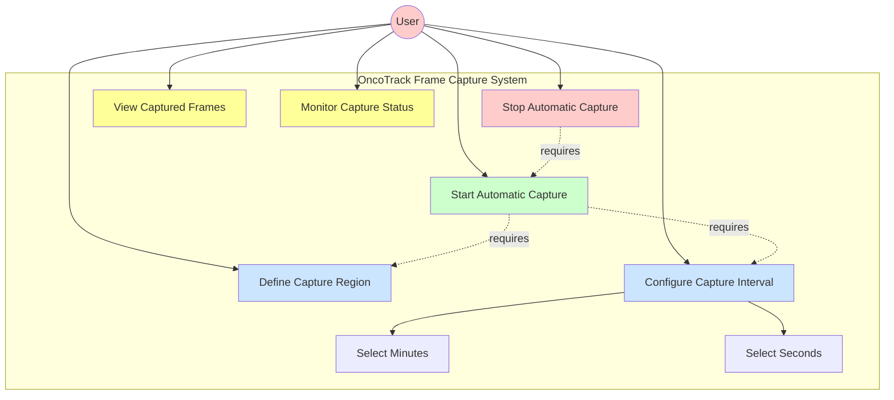
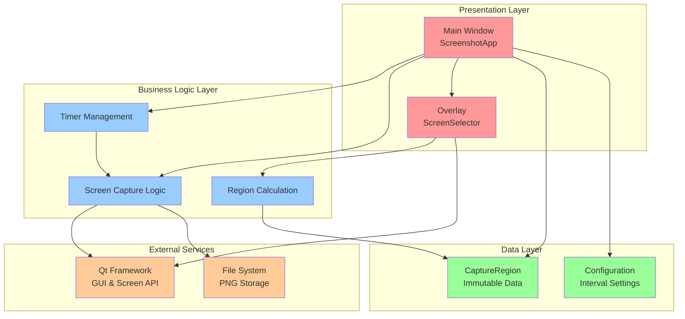
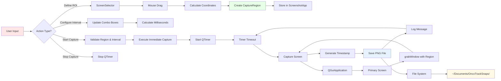
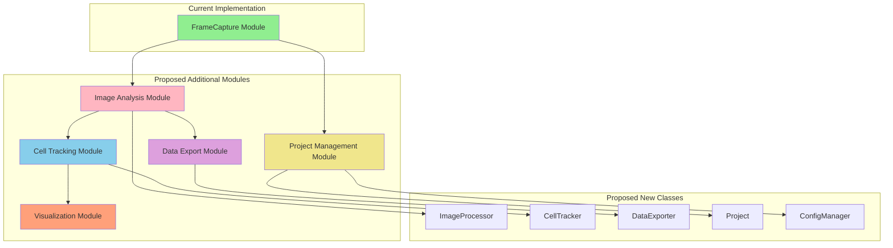

# OncoTrack UML Diagrams (Mermaid)

This document contains comprehensive UML diagrams for the oncoTrack repository using Mermaid syntax.

## Table of Contents
1. [Class Diagram](#1-class-diagram)
2. [Component Diagram](#2-component-diagram)
3. [Sequence Diagram - Region Selection](#3-sequence-diagram---region-selection)
4. [Sequence Diagram - Capture Flow](#4-sequence-diagram---capture-flow)
5. [State Machine Diagram](#5-state-machine-diagram)
6. [Use Case Diagram](#6-use-case-diagram)
7. [Architecture Overview](#7-architecture-overview)

---

## 1. Class Diagram



---

## 2. Component Diagram



---

## 3. Sequence Diagram - Region Selection



---

## 4. Sequence Diagram - Capture Flow



---

## 5. State Machine Diagram



---

## 6. Use Case Diagram



---

## 7. Architecture Overview



---

## Design Patterns Used

```mermaid
mindmap
  root((Design Patterns<br/>in OncoTrack))
    Observer Pattern
      Qt Signals/Slots
      selected signal
      cancelled signal
      timeout signal
    Model-View Pattern
      CaptureRegion (Model)
      ScreenshotApp (View/Controller)
    Value Object
      CaptureRegion
      Immutable dataclass
      Frozen attributes
    Command Pattern
      Button click handlers
      select_area()
      start_capture()
      stop_capture()
    Template Method
      Qt event handlers
      paintEvent()
      mousePressEvent()
      keyPressEvent()
```

---

## Data Flow Diagram



---

## Future Expansion - Proposed Architecture



---

## Notes

- All diagrams are in Mermaid syntax and can be rendered in:
  - GitHub (native support)
  - VS Code (with Mermaid extension)
  - Online editors like mermaid.live
  - Documentation sites (GitBook, Docusaurus, etc.)

- To view these diagrams:
  1. Install a Mermaid preview extension in your editor
  2. Or visit https://mermaid.live and paste the code blocks
  3. Or view this file in GitHub (it renders Mermaid automatically)

- These diagrams represent the current state of the codebase
- The "Future Expansion" section shows potential architectural growth
