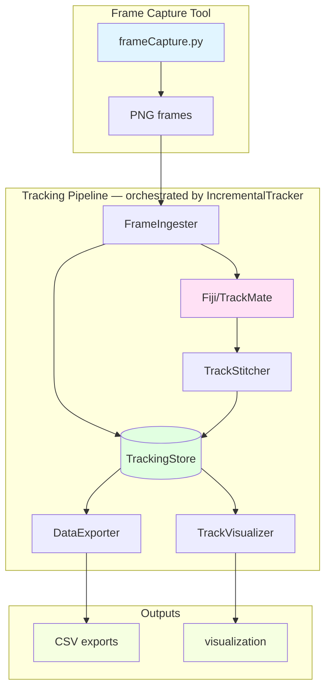
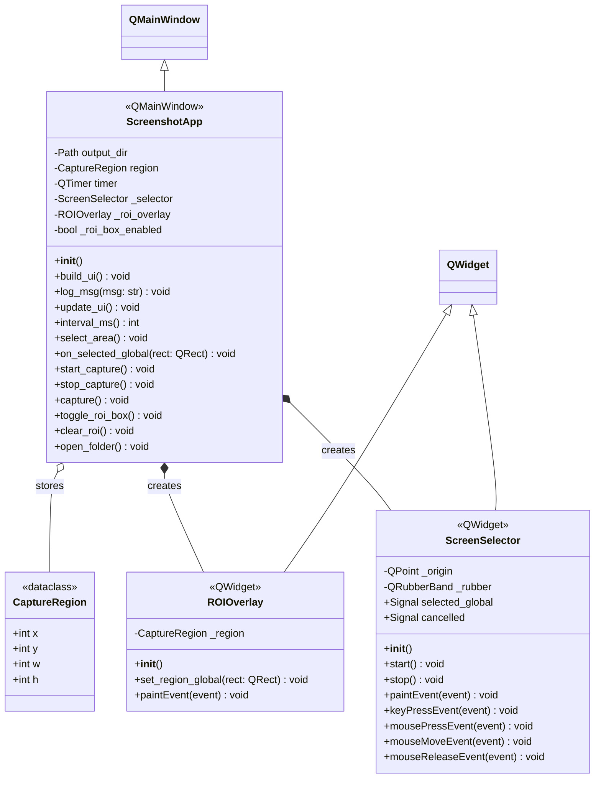
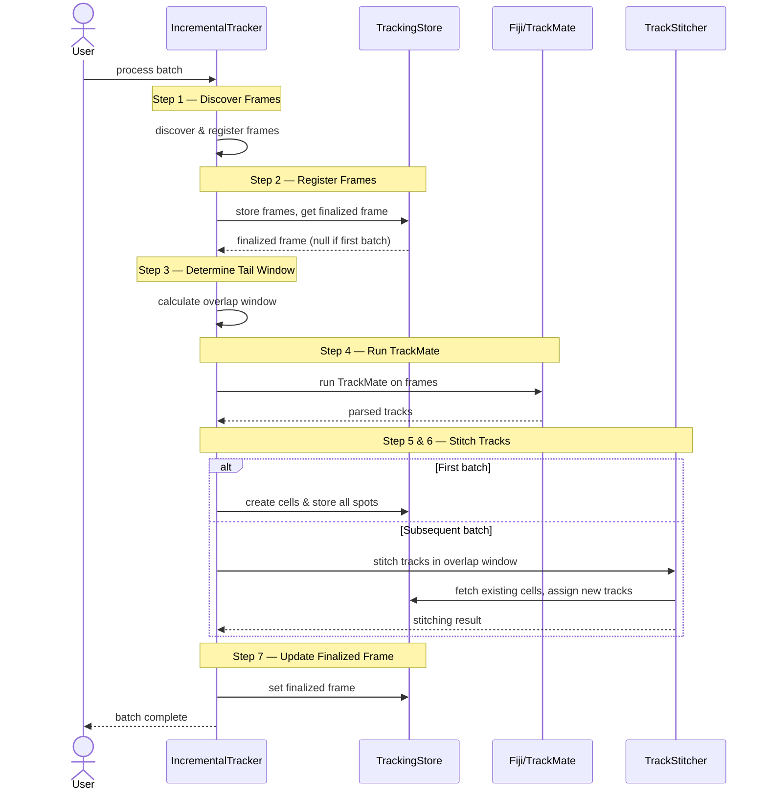
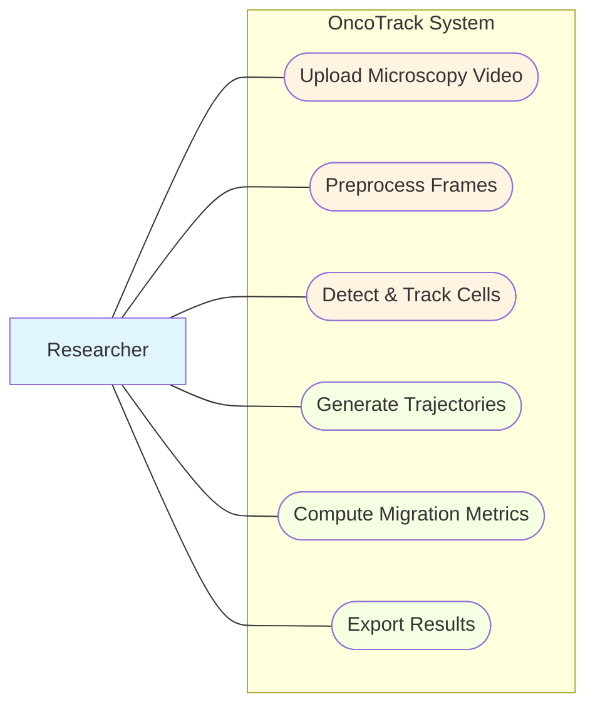

# OncoTrack UML Diagrams (Mermaid)

This document contains UML diagrams for the oncoTrack repository using Mermaid syntax.

## Table of Contents
1. [System Architecture Overview](#1-system-architecture-overview)
2. [Class Diagrams](#2-class-diagrams)
3. [Pipeline Sequence Diagram](#3-pipeline-sequence-diagram)
4. [Use-Case Diagram](#4-use-case-diagram)

---

## 1. System Architecture Overview

---

## 2. Class Diagrams

### 2a. Frame Capture Tool (tools/frameCapture.py)

### 2b. Tracking Pipeline (src/)

```mermaid
classDiagram
    class TrackerConfig {
        <<dataclass>>
        +str fiji_path
        +Path fiji_script
        +int overlap_window
        +int min_overlap_points
        +float max_distance_gate
        +str detector_type
        +float radius
        +float threshold
        +float linking_max_distance
        +float gap_closing_max_distance
        +int max_frame_gap
        +float pixel_size
        +float time_interval
        +Path db_path
    }

    class TrackingStore {
        -Path db_path
        +get_connection() contextmanager
        +add_frame(frame_index, timestamp, source_path) void
        +get_max_frame_index() int
        +create_cell(first_frame) int
        +update_cell_last_frame(cell_id, last_frame) void
        +get_all_cells() list
        +add_points(points) void
        +get_cell_points(cell_id) list
        +get_points_in_frame_range(start, end) list
        +get_cells_in_frame_range(start, end) list
        +add_event(event_type, parent_id, child_id, frame) void
        +start_run(batch_id, params, ...) int
        +complete_run(run_id, xml_path, csv_paths) void
        +get_finalized_frame() int
        +set_finalized_frame(frame) void
    }

    class FrameIngester {
        <<static>>
        +discover_frames(batch_dir) list
        +assign_sequential_indices(frames, start) list
        +get_frame_range(frames) tuple
        +validate_frames(frames) void
        +infer_batch_name(batch_dir) str
    }

    class BatchManager {
        -Path batches_dir
        +list_batches() list
        +get_batch_path(batch_name) Path
        +load_batch_frames(batch_name) list
    }

    class FijiRunner {
        -TrackerConfig config
        +__init__(config)
        +run_trackmate_on_frames(frames_dir, output_dir) dict
        +run_on_tail_window(all_frames_dir, frame_indices, output_dir) dict
    }

    class Spot {
        <<dataclass>>
        +int spot_id
        +int frame
        +float x
        +float y
        +float quality
        +float radius
        +distance_to(other: Spot) float
    }

    class Track {
        <<dataclass>>
        +int track_id
        +list spots
        +int num_spots
        +float duration
        +float displacement
        +get_frames() list
        +get_spot_at_frame(frame) Spot
        +get_spots_in_frame_range(start, end) list
    }

    class TrackMateParser {
        <<static>>
        +parse_spots_csv(csv_path) dict
        +parse_spots_in_tracks_csv(csv_path) dict
        +parse_tracks_csv(csv_path) dict
        +parse_all(output_dir) dict
        +get_frame_range(tracks) tuple
        +get_tracks_in_frame_range(tracks, start, end) dict
    }

    class StitchingResult {
        <<dataclass>>
        +dict matched_cells
        +list new_cells
        +list division_events
        +int total_tracks
        +int total_points_added
    }

    class TrackStitcher {
        -TrackingStore store
        -int min_overlap_points
        -float max_distance_gate
        +__init__(store, min_overlap_points, max_distance_gate)
        +stitch_tracks(tracks, overlap_start, overlap_end, new_start) StitchingResult
        -_get_existing_cells_in_overlap(start, end) dict
        -_match_tracks_to_cells(tracks, cells, start, end) dict
        -_calculate_overlap_cost(cell_map, track_spots) float
        -_add_new_points(tracks, track_to_cell, new_frame_start) int
    }

    class DataExporter {
        -TrackingStore store
        +export_master_csv(output_path, cell_ids) void
        +export_cells_summary(output_path) void
        +export_events(output_path) void
    }

    class TrackVisualizer {
        -TrackingStore store
        -TrackerConfig config
        +render_all_tracks(output_path, canvas_size, background_image) void
        +render_specific_cells(cell_ids, output_path, ...) void
        -_draw_cell_track(canvas, cell_id) void
        -_generate_color(cell_id) tuple
    }

    class IncrementalTracker {
        -TrackerConfig config
        -TrackingStore store
        -FijiRunner fiji_runner
        -TrackStitcher stitcher
        -DataExporter exporter
        -TrackVisualizer visualizer
        +__init__(config)
        +process_batch(batch_path, batch_name) void
        +export_data(output_dir) void
        +visualize(output_path, background_image) void
    }

    Track "1" *-- "many" Spot : contains
    TrackMateParser ..> Track : creates
    TrackMateParser ..> Spot : creates
    TrackStitcher *-- TrackingStore : uses
    TrackStitcher ..> StitchingResult : returns
    DataExporter *-- TrackingStore : uses
    TrackVisualizer *-- TrackingStore : uses
    TrackVisualizer *-- TrackerConfig : uses
    FijiRunner *-- TrackerConfig : uses
    IncrementalTracker *-- TrackerConfig : uses
    IncrementalTracker *-- TrackingStore : owns
    IncrementalTracker *-- FijiRunner : owns
    IncrementalTracker *-- TrackStitcher : owns
    IncrementalTracker *-- DataExporter : owns
    IncrementalTracker *-- TrackVisualizer : owns
```

---

## 3. Pipeline Sequence Diagram

---

## 4. Use-Case Diagram

The use-case diagram identifies the primary interactions between the Researcher and the OncoTrack system. The Researcher initiates all six core workflows: uploading microscopy video, preprocessing frames, detecting and tracking cells, generating trajectories, computing migration metrics, and exporting results. Together these use cases capture the full lifecycle of a cell-tracking experiment, from raw video input through to quantitative output. The diagram is intentionally high-level to highlight system scope rather than implementation detail.

---

## Notes

- All diagrams are in Mermaid syntax and can be rendered in:
  - GitHub (native support)
  - VS Code (with Mermaid extension)
  - Online editors like mermaid.live

- To view these diagrams:
  1. Install a Mermaid preview extension in your editor
  2. Or visit https://mermaid.live and paste the code blocks
  3. Or view this file in GitHub (it renders Mermaid automatically)
